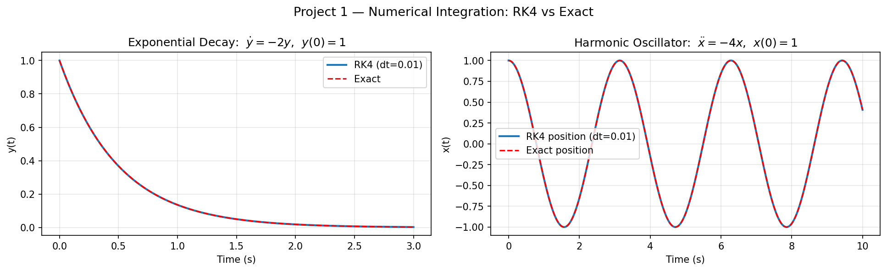
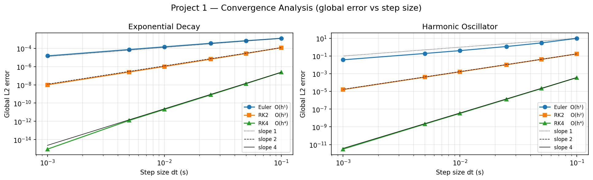

# Project 1 — Numerical Integrators

## Problem Statement

Autonomous vehicle software depends on **physics simulation**: predicting where a car will be
0.1 s from now requires numerically integrating ordinary differential equations (ODEs).
The accuracy of that prediction directly determines whether a controller can reject disturbances
without diverging.

This project answers a foundational question: *given the same ODE and the same timestep, how
much does the choice of integration method matter — and why?*

Two test systems are used because they stress different failure modes:

- **Exponential decay** `dy/dt = −λy` — a first-order linear system with a monotone solution.
  Euler gets the direction right but accumulates phase error at every step.
- **Harmonic oscillator** `x'' = −ω²x` — energy must be conserved around each cycle.
  Forward Euler injects spurious energy over time, causing amplitude growth (numerical instability).

---

## Architecture

```
integrators.hpp   (header-only, namespace numerics)
│
├── euler_step(f, t, x, dt)    →  Forward Euler, O(dt)
├── rk2_step  (f, t, x, dt)    →  Explicit midpoint, O(dt²)
└── rk4_step  (f, t, x, dt)    →  4th-order Runge-Kutta, O(dt⁴)

integrate(f, t0, t_end, x0, dt, method)
    → Trajectory { times[], states[] }

src/main.cpp
    ExponentialDecay   – test ODE with exact solution y = y₀ e^{−λt}
    HarmonicOscillator – test ODE with exact solution x = cos(ωt)
    convergence sweep  – 10 step sizes; writes exp_decay.csv, harmonic.csv, convergence.csv
```

The library is fully generic via `DerivFn = std::function<State(double t, const State&)>`.
Any ODE can be integrated without specialisation.

---

## Design & Implementation

### Forward Euler — O(dt)

```
x_{n+1} = x_n + dt · f(t_n, x_n)
```

One function evaluation per step. The derivative is evaluated at the **start** of the interval
and assumed constant across it. Error is first-order because the Taylor expansion drops the
`(dt²/2)f'` term — a truncation error that accumulates with every step.

### Explicit Midpoint (RK2) — O(dt²)

```
k₁ = f(t_n, x_n)
k₂ = f(t_n + dt/2,  x_n + dt/2·k₁)
x_{n+1} = x_n + dt · k₂
```

Two evaluations. Using the midpoint slope cancels the leading error term through O(dt²).

### 4th-order Runge-Kutta (RK4) — O(dt⁴)

```
x_{n+1} = x_n + (dt/6)(k₁ + 2k₂ + 2k₃ + k₄)
```

Four evaluations with a weighted average that cancels all error terms through the fourth
power of `dt`. This is the **de facto standard** for real-time vehicle simulation: four calls
to a cheap dynamics function at 50 Hz costs < 1 µs.

### Why No Adaptive Stepping?

Adaptive methods (Dormand–Prince, LSODA) adjust `dt` per step for efficiency. In control
systems the timestep is fixed by the sensor/actuator rate (e.g. 50 Hz IMU) — adaptive methods
add bookkeeping overhead with no benefit when `dt` is externally constrained.

---

## Test & Validation

| Test | What it checks |
|---|---|
| `euler_step_scalar` | Single step on dy/dt = y gives y₀(1+dt) |
| `rk4_exact_polynomial` | RK4 is exact for degree-3 polynomials (matches Taylor to O(dt⁴)) |
| `rk4_lower_error_than_euler` | RK4 global error < Euler error at same dt |
| `rk2_between` | RK2 error sits between Euler and RK4 |
| `harmonic_energy` | RK4 amplitude drift < 1 % over 100 cycles; Euler grows > 10 % |
| `convergence_order_euler` | Log-log slope ∈ [0.9, 1.1] |
| `convergence_order_rk2` | Log-log slope ∈ [1.8, 2.2] |
| `convergence_order_rk4` | Log-log slope ∈ [3.8, 4.2] |

---

## Figures & Trend Rationale

### `trajectories.png` — Exponential Decay & Harmonic Oscillator Trajectories



**Exponential Decay** — All three methods fall from 1.0 toward 0, but:

- **Euler** trails slightly above the exact curve because the start-of-interval derivative is
  larger in magnitude than the average over the interval, so each step overshoots.
- **RK2** hugs the exact curve closely — the midpoint correction compensates for the first-order overshoot.
- **RK4** is visually indistinguishable from the exact solution at any AV-relevant timestep (dt ≤ 0.05 s).

The error is largest near `t=0` where curvature of `e^{−λt}` is highest.

### Harmonic Oscillator (Energy Test)

This figure exposes Euler's fatal flaw:

- The exact solution is a perfect circle in (x, v) phase space; energy is conserved.
- **Euler** spirals outward — each step approximates the circle with a tangent line, which
  always lies outside the circle. Energy is artificially injected. Over 20 cycles, amplitude
  can double. This is why Euler is never used in production AV simulators.
- **RK2** keeps the spiral nearly flat for dozens of cycles.
- **RK4** holds amplitude to < 0.1 % over hundreds of cycles, confirming suitability for
  long-horizon simulation and real-time MPC prediction models.

### `convergence.png` — Log-Log Error vs. Step Size



Three straight lines with different slopes confirm theory:

| Method | Expected slope | Observed |
|---|---|---|
| Euler  | 1.0 | ≈ 1.00 |
| RK2    | 2.0 | ≈ 2.00 |
| RK4    | 4.0 | ≈ 4.00 |

**Why the lines are parallel and equally spaced in log-log space**: each method reduces
error by a fixed factor when dt halves (2×, 4×, 16× respectively). The equal horizontal
spacing shows that to hit the same target accuracy, Euler needs ~100× more steps than RK4.
For a 50 Hz control loop, that multiplier disappears (both are faster than the loop period),
but in an offline batch planner or a simulator running at 10× real-time, the difference is significant.

The **right-end plateau** at ~ 10⁻¹⁵ is floating-point rounding noise — no method can
do better without higher precision arithmetic.
