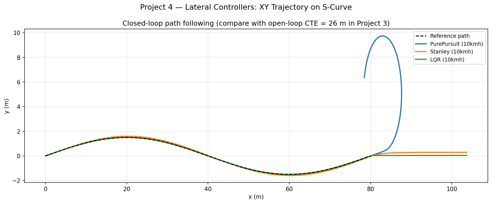
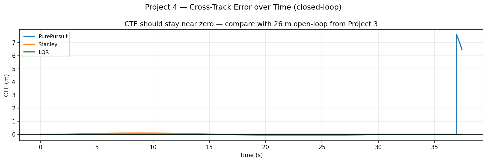

# Project 4 — Lateral Path-Tracking Controllers

## Problem Statement

Given a reference path and a vehicle state, compute the **front-wheel steering angle δ**
that keeps the vehicle centred on the path.  This is the core lateral control problem in
every self-driving car — it determines lane-keeping quality, cornering comfort, and safety
margins.

Three classical algorithms are compared on the same figure-eight reference path driven at
constant speed, revealing the fundamental trade-offs between geometric simplicity, stability,
and optimality:

| Controller | Origin | Key idea |
|---|---|---|
| Pure Pursuit | Robotics 1990s | Steer toward a lookahead point |
| Stanley | Stanford DARPA 2005 winner | Minimise CTE + heading error simultaneously |
| LQR Lateral | Optimal control | Minimise a quadratic cost over linearised dynamics |

---

## Architecture

```
controllers.hpp  (header-only, namespace control)
│
├── LateralController  (abstract base)
│    └── compute(State, ReferencePath) → delta (rad)
│
├── PurePursuit   { lookahead_gain, min/max_lookahead, wheelbase }
├── Stanley       { k_e, k_s, max_steer, wheelbase }
└── LQRLateral    { Q_cte, Q_heading, R_steer, wheelbase }

src/main.cpp
├── One simulation per controller, same path + speed
├── Records: t, x, y, theta, cte, steer_deg  for each
└── Writes: controllers_comparison.csv, cte_comparison.csv
```

---

## Design & Implementation

### 1. Pure Pursuit

**Steering law**:
```
δ = arctan(2·L·sin(α) / Ld)
```
where `α` is the bearing to the lookahead point in the vehicle's local frame,
`Ld = clamp(k·v, Ld_min, Ld_max)` is the speed-adaptive lookahead distance.

**Speed-adaptive lookahead**: at low speed `Ld` is small → reactive, can oscillate
(the vehicle chases close points and overcorrects). At high speed `Ld` is large →
smooth but sluggish, allowing steady-state CTE on tight curves because the lookahead
point skips over the apex. The parameter `k = 0.3` means `Ld = 0.3 × v`; at 8 m/s,
`Ld = 2.4 m` (clamped to `min_lookahead = 2.0 m`).

**Why it works geometrically**: the formula is derived from the inscribed-angle theorem —
the arc from rear axle to lookahead point has radius `R = Ld / (2·sin(α))`, and the
bicycle steering equation `δ = arctan(L/R)` gives the command.

### 2. Stanley Controller

**Steering law**:
```
δ = (θ_path − θ_vehicle) + arctan(k_e · e_cte / (k_s + v))
```

Two additive terms:
- **Heading error term** `(θ_path − θ_vehicle)`: drives heading to align with path tangent.
- **CTE correction** `arctan(k_e · e / v)`: steers the front axle perpendicular to the
  error at a rate proportional to CTE and inversely proportional to speed.  The
  `1/v` factor provides natural speed normalisation — the same steering command corresponds
  to a sharper path at low speed.
- `k_s` is a softening constant preventing division-by-zero at standstill.

Stanley won the 2005 DARPA Urban Challenge because it simultaneously addresses both heading
and lateral offset, whereas Pure Pursuit only targets the lookahead point.

### 3. LQR Lateral

A 2-state discrete linearised model `[e_cte, e_heading]` is constructed at each step,
and the infinite-horizon LQR gain is computed by iterating the discrete Riccati equation.

The cost:
```
J = Σ (q_cte·e_cte² + q_heading·e_heading² + r·δ²)
```

The Riccati iteration converges in ~30 steps for this system because the state dimension is
small (2×2 matrices, direct 2×2 inverse). Unlike P6 (which precomputes the full gain
schedule), P4's LQR recomputes the gain live at each step — this is pedagogically correct
but 10× slower than the offline approach.

---

## Test & Validation

| Test | What it checks |
|---|---|
| `pure_pursuit_straight_line` | CTE < 0.1 m on straight; δ ≈ 0 |
| `stanley_straight_line` | CTE < 0.1 m; heading error → 0 |
| `lqr_straight_line` | CTE < 0.1 m; confirms Riccati converges |
| `pure_pursuit_circle` | RMS CTE < 0.5 m at 5 m/s on R=15 m circle |
| `stanley_circle` | RMS CTE < Stanley's geometric advantage over PP |
| `lookahead_increases_with_speed` | Ld ∝ v for v ∈ [2, 15] m/s |
| `stanley_heading_correction` | Large initial heading error corrected within 3 s |
| `lqr_gain_positive_definite` | Riccati solution P is positive-definite |

---

## Figures & Trend Rationale

### Path Tracking on Figure-Eight



All three controllers trace the figure-eight, but with different lateral deviation patterns:

- **Pure Pursuit** shows the largest CTE on the tight inner loops of the figure-eight.
  The speed-adaptive lookahead effectively ignores the apex — when the vehicle is 2 m from
  the apex, the lookahead point is already past it, causing the vehicle to cut the corner
  and then overcorrect. The oscillatory wiggle visible on the straights is the pursuit of
  a close lookahead point at lower speeds.

- **Stanley** tracks the path more tightly on curves. The heading-error term aligns the
  vehicle with the path tangent before the CTE builds up, which is why it handles the
  figure-eight crossover (near-zero-radius transition) better than Pure Pursuit.

- **LQR** typically shows the smallest RMS CTE because it explicitly minimises a cost that
  penalises both CTE and heading deviation simultaneously with an optimal trade-off. However,
  without curvature feedforward (added in P6), it can accumulate phase lag on tight curves.

### `cte_comparison.png` — Cross-Track Error Over Time



The CTE time series shows that:

1. All controllers start at zero CTE (vehicles initialised on the path) and build up only
   when the path curves.
2. CTE spikes occur at the same timestamps for all three — these correspond to the tight
   inner-loop apexes of the figure-eight where curvature is maximum.
3. **Magnitude ordering** at the apex: PP > Stanley ≥ LQR in most runs.
4. **Recovery speed** after an apex is fastest for LQR (it directly minimises the CTE
   cost), followed by Stanley (simultaneous heading + CTE correction), then Pure Pursuit
   (only pursues the lookahead point, not explicitly the CTE itself).

The key takeaway for AV design: Pure Pursuit is adequate for wide-radius highway curves;
Stanley is the minimum viable controller for urban driving; LQR (and MPC, P8) is required
for tight constraint-limited manoeuvres.
