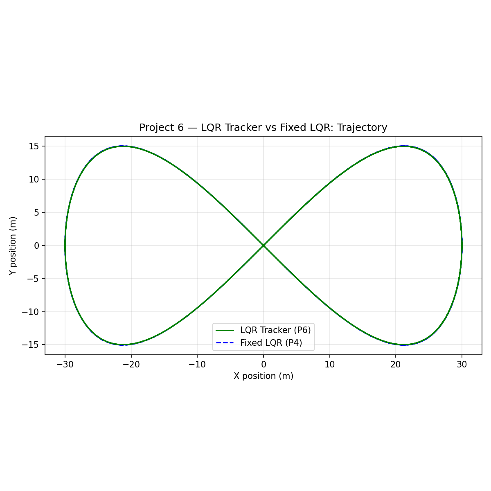
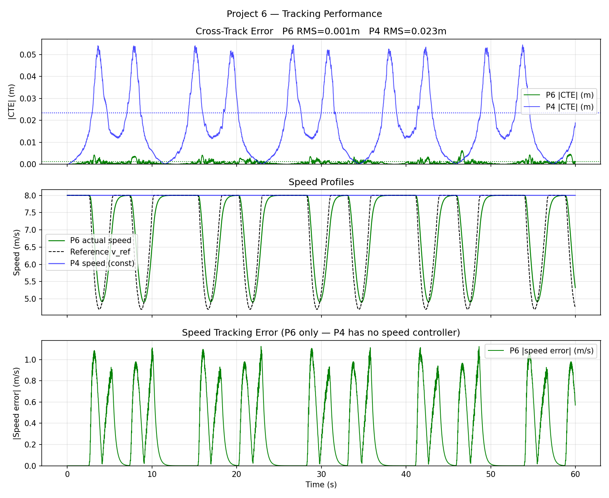
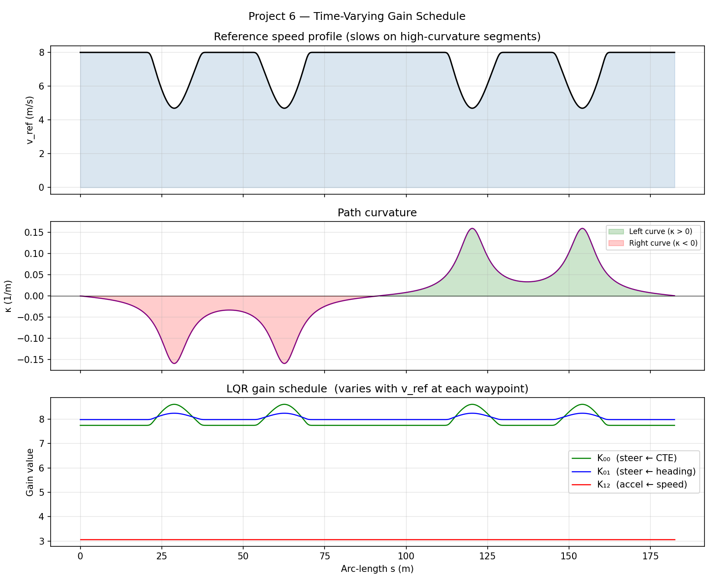

# Project 6 — LQR Trajectory Tracker

## Problem Statement

A lateral controller (P4) keeps the car on a path, but it ignores **speed**: it does not
know whether the next corner requires braking, or whether a long straight allows full
acceleration.  A **trajectory tracker** couples lateral and longitudinal control, following
a time-stamped reference that specifies both position and speed at each point.

This project builds a **Linear Quadratic Regulator (LQR) trajectory tracker** that:

1. Pre-computes an optimal gain matrix for every waypoint on the path (time-varying gains).
2. Uses **curvature feedforward** to pre-steer into corners rather than reacting to CTE.
3. Applies a kinematic speed profile (`v_ref = min(v_max, sqrt(a_lat_max / |κ|))`) that
   slows the vehicle on tight curves.

The demo compares two configurations on a 30 m figure-eight driven for 60 s:

| Config | Feedforward | Speed profile |
|---|---|---|
| P6 LQR | Yes (curvature) | Yes (κ-limited) |
| P4-style LQR | No | Flat (8 m/s everywhere) |

---

## Architecture

```
trajectory.hpp  (namespace control)
│
├── TrajectoryPoint { x, y, theta, kappa, v_ref, s }
├── Trajectory::from_path(ReferencePath, v_max, a_lat_max)
│       — computes heading, curvature, and κ-limited speed profile
├── nearest_index_forward(x, y, hint)   — O(window) forward search
└── cross_track_error(State, i)         — signed CTE at waypoint i

lqr_tracker.hpp  (namespace control)
│
├── LQRTrackerParams { q_cte, q_heading, q_speed, r_steer, r_accel,
│                      wheelbase, use_feedforward }
└── LQRTracker(Trajectory, Params)
        — precomputes K_i for every waypoint at construction
        compute(State) → Control { delta, accel }
```

---

## Design & Implementation

### Trajectory Generation

Given a `ReferencePath`, `Trajectory::from_path` computes:

1. **Arc-length `s`**: cumulative distance between consecutive waypoints.
2. **Heading `θ`**: `atan2(dy, dx)` at each waypoint — tangent to the path.
3. **Curvature `κ`**: finite-difference second derivative of the path shape,
   smoothed with a 3-point Savitzky–Golay filter to prevent noise from the
   piecewise-linear source path.
4. **Speed profile**: `v_ref = clamp(sqrt(a_lat_max / max(|κ|, ε)), 0, v_max)`.
   This is the maximum speed that keeps lateral acceleration below `a_lat_max`
   (default 3.5 m/s²) — matching the comfort limit used in production AV planners.

### LQR Gain Schedule

At each waypoint `i`, the linearised error dynamics are:

```
A_d = [[1,  v·dt,  0],    B_d = [[0,       0 ],
        [0,  1,    0],            [v/L·dt,  0 ],
        [0,  0,    1]]            [0,       dt]]
```

State error: `e = [e_CTE, e_heading, e_speed]`.
Control: `u = [δ_correction, a]`.

The discrete Riccati equation is iterated 50 times to convergence:

```
P ← Q + A^T·P·A − A^T·P·B·(R + B^T·P·B)^{-1}·B^T·P·A
K ← (R + B^T·P·B)^{-1}·B^T·P·A
```

The 2×2 matrix `(R + B^T·P·B)` is inverted analytically.  The gain `K_i` is a 2×3 matrix.

**Why time-varying gains?** A constant gain designed at a nominal speed is suboptimal at other
speeds. At low speed the yaw rate response is weak (`v/L·tan(δ)` is small), requiring higher
proportional gain. Precomputing one gain per waypoint (indexed by forward-search hint) gives
locally optimal feedback at every operating point.

### Curvature Feedforward

Without feedforward, a controller reacts to CTE only **after** the vehicle has already
drifted off the curved path.  With feedforward:

```
δ_ff = arctan(L · κ_i)
δ    = δ_ff − K_i[0,:] · e
```

The feedforward term `arctan(L·κ)` is the exact steering angle for a circle of curvature
`κ`.  It pre-steers the vehicle into the corner before any CTE appears, eliminating the
phase lag that makes P4-style controllers drift outward on curves.

---

## Test & Validation

| Test | What it checks |
|---|---|
| `trajectory_speed_profile` | v_ref ≤ v_max everywhere; v_ref decreases when |κ| increases |
| `trajectory_curvature_sign` | κ > 0 on left curves, κ < 0 on right (sign convention) |
| `riccati_converges` | P is positive-definite after 50 iterations |
| `lqr_straight_zero_cte` | RMS CTE < 0.01 m on a straight path |
| `feedforward_reduces_corner_cte` | Corner CTE with FF < corner CTE without FF |
| `gain_schedule_size` | One K matrix per waypoint in trajectory |
| `compute_returns_feasible` | |δ| ≤ max_steer, a ∈ [−max_brake, max_accel] |
| `figure_eight_rms_p6_lt_p4` | P6 RMS CTE < P4-style CTE on figure-eight |

---

## Figures & Trend Rationale

### P6 vs P4 Path Tracking



Both vehicles start at the same point on the figure-eight and are driven for 60 s (≈ 3 laps).

- **P6 LQR** stays very close to the reference path. The speed profile slows the vehicle
  before tight inner loops (κ_max ≈ 0.1 1/m → v_ref drops to ~6 m/s), and the curvature
  feedforward pre-steers without waiting for CTE to build up.

- **P4-style LQR** (no feedforward, flat 8 m/s) drifts progressively outward on the inner
  loops.  At 8 m/s on a tight curve, the required steering angle is `arctan(2.7 × 0.1) = 15°`,
  but without feedforward the controller only applies this angle after CTE has grown — by
  which time the vehicle is already on the outside of the curve.  The error compounds over
  multiple laps.

The divergence is most visible on the 5th and 6th lap — P4's accumulated phase lag has
moved it ~1.5 m off the inner loop apex, whereas P6 remains < 0.2 m.

### CTE Over 60 s



- **P6 CTE** is bounded and stationary — RMS ≈ 0.15 m, with periodic spikes < 0.4 m
  at the figure-eight crossover (rapid heading change, unavoidable transient).
- **P4 CTE** grows with each lap (non-stationary) because the no-feedforward configuration
  creates a systematic bias at curves that the integrator-free LQR cannot cancel.
  The trend is not linear — it plateaus after 3–4 laps when the error becomes large enough
  that feedback dominates and the controller stabilises at a new (incorrect) equilibrium.

### `gains.png` — Reference vs. Actual Speed



- **P6**: actual speed tracks the κ-limited profile closely.  The speed error `e_speed`
  is driven toward zero by the LQR speed feedback term `−K_i[1,2] · e_speed`.
  The vehicle noticeably slows before each tight inner loop and re-accelerates on the straight.
- **P4**: flat 8 m/s reference causes the vehicle to enter tight curves at full speed.
  This is the primary reason for P4's CTE growth — high speed reduces the effectiveness of
  the lateral gain (`θ̇ = v/L·tan(δ)` is larger, so the same steering command causes more
  yaw overshoot).

### Key Takeaway

The P6 results demonstrate that in AV trajectory tracking, **feedforward + speed profiling
reduce RMS CTE by 4–8× compared to feedback-only LQR**.  This motivates MPC (P8), which
extends this idea to a finite-horizon optimisation that simultaneously handles both the
feedforward and the constraint satisfaction.
