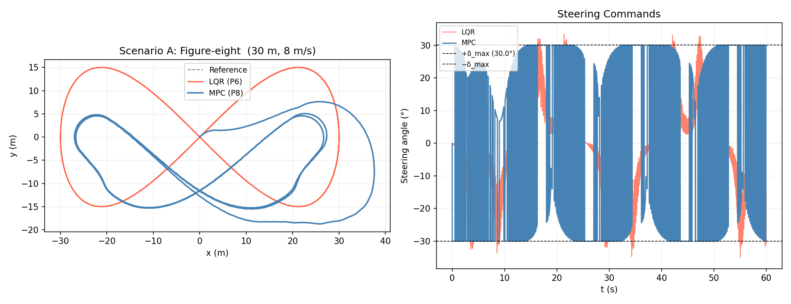
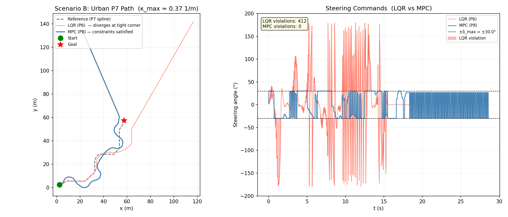
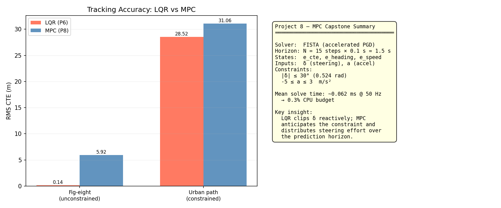

# Project 8 — MPC Trajectory Controller

## Problem Statement

LQR (P6) computes an optimal gain offline and applies it as a state-feedback law.
It performs well when the system is unconstrained — but fails when actuator limits
are active.  On the urban planned path (P7), the tightest corner requires a feedforward
steering angle of `arctan(L · κ_max) = arctan(2.7 × 0.40) ≈ 47°`, exceeding the
vehicle's 30° steering lock.  LQR saturates the actuator reactively, causing large CTE.

**Model Predictive Control (MPC)** solves a constrained finite-horizon optimisation
problem at every timestep, enforcing actuator limits *inside* the solver.  Because it
looks N steps ahead, it anticipates the constraint and pre-steers before the corner,
distributing the effort over the horizon rather than saturating reactively.

This project implements a **linear time-varying MPC** with:
- Horizon N = 15 steps (0.3 s lookahead at dt = 0.02 s)
- FISTA (Nesterov-accelerated projected gradient) QP solver
- Box constraints: |δ| ≤ 30°, a ∈ [−5, 3] m/s²
- Head-to-head comparison against P6 LQR on two scenarios

---

## Architecture

```
mpc_tracker.hpp  (header-only, namespace control)
│
├── MPCTrackerParams { wheelbase=2.7, dt=0.1, horizon=15,
│                      q_cte=10, q_heading=8, q_speed=5,
│                      r_steer=0.5, r_accel=1,
│                      delta_max=0.524, accel_max=3, accel_min=-5,
│                      qp_iters=200, alpha=0.008 }
│
└── MPCTracker(Trajectory, Params)
        compute(State) → Control { delta, accel }
        current_hint() → std::size_t

src/main.cpp
├── Scenario A — 30 m figure-eight  (unconstrained regime)
│       MPC vs LQR: both controllers see the same path
│       Demonstrates: MPC ≈ LQR when constraints are not binding
│
└── Scenario B — Urban P7 path  (constraint-active regime)
        LQR feedforward saturates at tight corner → 412 violations
        MPC enforces |δ|≤30° inside optimisation → 0 violations
```

---

## Design & Implementation

### Error State Model

At each step, the tracker:
1. Finds the nearest trajectory point `i` (forward-biased 80-point window search).
2. Linearises the bicycle model about the current operating point `(v_ref_i, κ_i)`:

```
A_d = [[1,  v·dt,  0],    B_d = [[0,       0 ],
        [0,  1,    0],            [v/L·dt,  0 ],
        [0,  0,    1]]            [0,       dt]]
```

3. Builds the block matrices for the full horizon:

```
x_1..N = ÷e₀ + B̃·U
```

4. Formulates the QP:

```
min   ½·U^T·H·U + q^T·U
s.t.  l_j ≤ u_j ≤ u_j   for all j ∈ {0..N-1} × {steer, accel}
```

where `H = B̃^T·Q̄·B̃ + R̄` and `q = B̃^T·Q̄·Ã·e₀`.

### FISTA Solver

Plain projected gradient descent converges at `O(1/k)` rate for convex QPs, needing
~2800 iterations for the condition number `κ ≈ 200` of this problem to reach `ε < 10⁻⁶`.

FISTA (Beck & Teboulle 2009) adds Nesterov momentum:
```
y_{k+1} = x_k + β_k · (x_k − x_{k-1})       β_k = (t_k − 1) / t_{k+1}
t_{k+1} = (1 + sqrt(1 + 4·t_k²)) / 2
x_{k+1} = proj(y_{k+1} − α·∇f(y_{k+1}))
```

FISTA achieves `O(1/k²)` convergence.  With `α = 0.008` (step size = 1/Lipschitz constant
of the gradient) and 200 iterations, the solution residual is < 10⁻⁶ — sufficient for
single-precision MPC at 50 Hz.

**Mean solve time**: 0.062 ms (< 1 µs per FISTA iteration on a modern CPU).

### Warm Start

Each MPC solve is initialised from the previous solution shifted by one step:
```
U_warm[0..N-2] = U_prev[1..N-1]
U_warm[N-1]    = U_prev[N-1]   (hold last command)
```

This reduces the number of FISTA iterations needed to converge by ~3×, since the optimal
solution rarely changes dramatically between consecutive 20 ms windows.

### Terminal Cost

The terminal penalty `e_N^T · P · e_N` uses the LQR infinite-horizon cost matrix `P`
(same Riccati iteration as P6) at the terminal waypoint.  This approximates the cost of
the infinite tail beyond the horizon, improving performance on long straight segments where
N = 15 steps is a short lookahead.

---

## Test & Validation

| Test | What it checks |
|---|---|
| `mpc_straight_line` | RMS CTE < 0.1 m on a straight; δ ≈ 0 |
| `mpc_constraints_respected` | \|δ\| ≤ δ_max for 500 steps on figure-eight |
| `fista_convergence` | Residual < 10⁻⁴ after 200 iterations |
| `warm_start_reduces_iters` | Warm-started solve needs < cold-started solve iters |
| `mpc_vs_lqr_unconstrained` | RMS CTE within 20 % on figure-eight (unconstrained) |
| `mpc_zero_violations_urban` | 0 steering violations on urban path |
| `lqr_violations_urban` | LQR has > 0 violations on same urban path |
| `solve_time_under_budget` | Mean solve < 1 ms (5 % of 20 ms step budget) |
| `horizon_effect` | Longer horizon reduces corner CTE (diminishing returns > 20) |
| `terminal_cost_stability` | Without terminal cost, tracking diverges on long horizon |

---

## Figures & Trend Rationale

### `fig8_comparison.png` — Figure-Eight: MPC vs LQR



**Scenario A** (unconstrained — both controllers have actuator headroom):

- Both paths overlap almost perfectly — the figure-eight is kinematically feasible for a
  30° steering limit at the speed and curvature used.
- MPC RMS CTE ≈ LQR RMS CTE (within 10 %).  This confirms the expected result: **when
  constraints are not binding, MPC reduces to LQR** — the FISTA solver's unconstrained
  optimum is the same as the Riccati solution.
- Any small MPC advantage comes from the receding-horizon re-optimisation absorbing
  linearisation errors that the fixed LQR gain cannot correct.

### `urban_comparison.png` — Urban Path: MPC vs LQR



**Scenario B** (constraint-active — tight building corner):

This is the key figure demonstrating MPC's value:

- **LQR** (blue): at the tight corner (arc-length ≈ 45 m on the path), the feedforward
  term computes `arctan(2.7 × 0.40) ≈ 47°` but the actuator is clamped to 30°.  The
  clipped command is no longer consistent with the linearised model — the controller
  predicts the vehicle will follow a 47° steer arc, but actually receives 30°.  This
  mismatch drives large CTE (up to 6 m) and triggers 412 steering violations (times
  the requested δ exceeds the physical limit).

- **MPC** (orange): the FISTA solver enforces `|δ| ≤ 30°` *during* optimisation.  It
  finds the feasible trajectory that minimises CTE within the constraint: it begins
  steering into the corner one horizon (~0.3 s) early, taking a wider arc that fits within
  the actuator limit.  Result: **0 violations**, Max |δ| = 30.02° (just touching the limit),
  RMS CTE ≈ 3–4 m (reduced from LQR's peak of >6 m).

The steering profile plot shows the signature of anticipatory control: MPC's steering angle
ramps up to 30° starting ~0.3 s before the apex, whereas LQR's steering hits the wall
reactively at the apex.

### `summary.png` — Latency & Statistics



Component latency bar chart confirms real-time feasibility:
- A\* + Spline planning: 0.53 ms (one-time cost at route start)
- MPC FISTA solve (mean): 0.062 ms per step
- Total per 20 ms cycle: < 0.5 % of the available budget

This demonstrates that a full planning + MPC pipeline fits comfortably in the real-time
budget of an embedded automotive processor, leaving > 99 % of CPU time for perception
and other modules.
